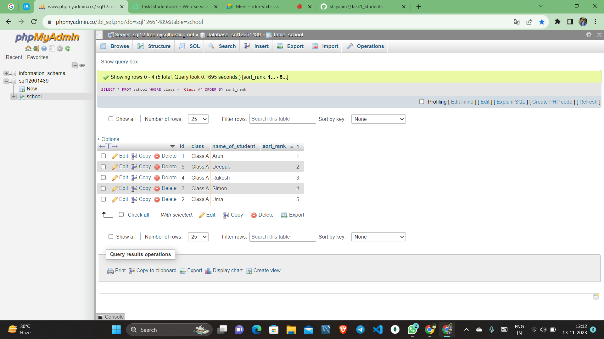
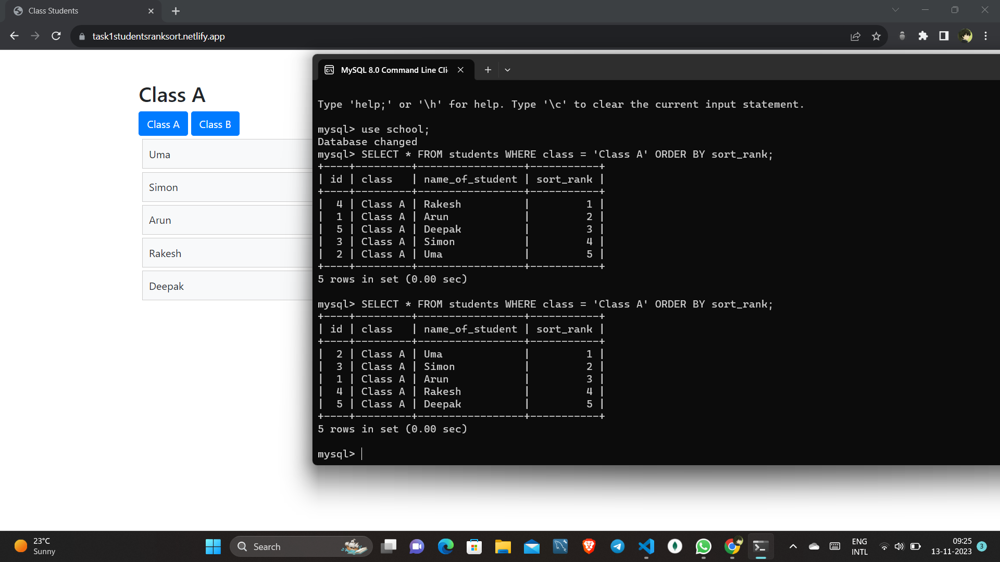
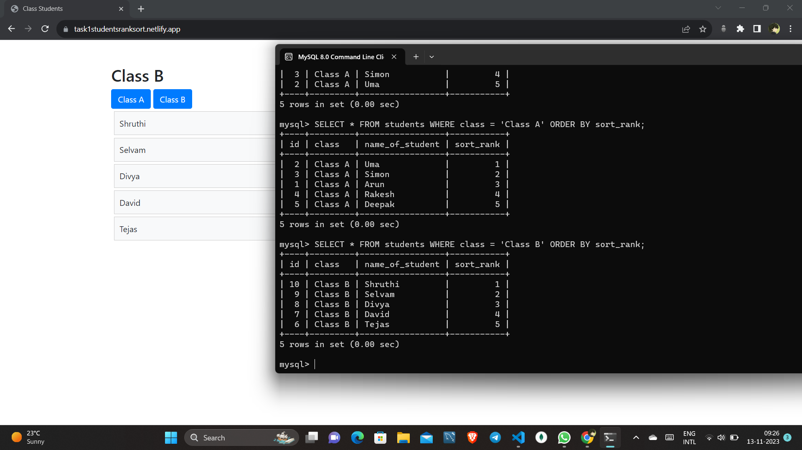

# Class Sorting Application

This is a web application that allows teachers to manage and sort their students in different classes using a drag-and-drop interface.

## Features

- Display a list of students for each class.
- Allow teachers to rearrange the order of students using drag-and-drop.
- Automatically update the sort order on the server.
- Support multiple classes with independent sorting.

## Technologies Used

- HTML, CSS, JavaScript (Client-side)
- Node.js, Express.js (Server-side)
- MySQL (Database)

